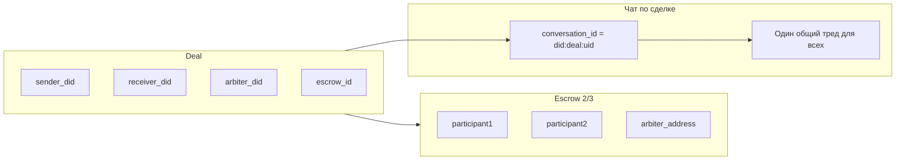

# План: мультисделка с тредами и комиссионерами

## Текущая архитектура

- **Сделка**: [db/models.py](db/models.py) — `Deal`: `sender_did`, `receiver_did`, `arbiter_did`, `escrow_id`; эскроу один на сделку.
- **Эскроу**: [services/tron/escrow.py](services/tron/escrow.py) — `create_payment_transaction(escrow_id, to_address, amount, ...)` строит **одну** транзакцию с **одним** получателем.
- **Чат**: [services/chat/service.py](services/chat/service.py) — при `deal_uid != null` все сообщения пишутся с `conversation_id = get_deal_did(deal_uid)` (одна лента на сделку для всех трёх участников).

---

## Часть 1. Разные треды внутри одной сделки

**Цель**: у каждого участника свой тред с другим участником (sender–receiver, sender–arbiter, receiver–arbiter); арбитр видит все три треда.

### 1.1 Модель треда

- **Вариант A (без новой таблицы)**: `conversation_id` для сделки задаётся как `did:deal:{deal_uid}:{thread_key}`, где `thread_key` — каноническая пара DID, например `sorted([did_a, did_b])` через разделитель (например `|`), чтобы тред однозначно определялся парой.
  - Примеры: `did:deal:abc123:did:tron:A|did:tron:B`, `did:deal:abc123:did:tron:A|did:tron:C`.
- **Вариант B**: таблица `deal_thread` (id, deal_uid, participant_a_did, participant_b_did, created_at) и `conversation_id = did:deal:{deal_uid}:{thread_id}`. Гибче для метаданных и списка тредов по сделке.

Рекомендация: начать с **варианта A** (минимальные изменения), при необходимости позже ввести таблицу тредов.

### 1.2 Изменения в ChatService

- **add_message**: добавить опциональный параметр `thread_other_did: Optional[str] = None`. Если передан `deal_uid` и `thread_other_did`, считать тред парой `(current_user, thread_other_did)` и выставлять `conversation_id = did:deal:{deal_uid}:{thread_key}`; иначе (обратная совместимость) — как сейчас `did:deal:{deal_uid}`.
- **Кого записывать в Storage**: для треда между A и B писать записи только для `owner_did in (A, B)` (двое), а не для всех трёх участников сделки. Арбитр видит тред «арбитр–отправитель» и «арбитр–получатель», но не тред отправитель–получатель (если не решите иначе).
- **get_history**: без изменений — вызывается с нужным `conversation_id` (идентификатором треда).

Файлы: [services/chat/service.py](services/chat/service.py) (логика `conversation_id` и списка `owner_dids` в блоке с `deal_uid`).

### 1.3 API для тредов по сделке

- **GET /api/deals/{deal_uid}/threads** (или в рамках существующего роута сделки): возвращает список тредов, в которых участвует текущий пользователь. Для арбитра — все треды по этой сделке (sender–receiver, sender–arbiter, receiver–arbiter). Для sender/receiver — только треды с их участием.
- Формат элемента: `{ "conversation_id": "did:deal:...", "participants": ["did:...", "did:..."], "label": "С получателем" | "С арбитром" и т.п. }`.
- Фронт при открытии сделки запрашивает этот список и показывает переключение между тредами (вкладки или сайдбар); при отправке сообщения передаёт `thread_other_did` (или эквивалент), чтобы бэкенд записал в нужный тред.

Файлы: новый или расширение в [routers/payment_request.py](routers/payment_request.py) / [routers/chat.py](routers/chat.py); [services/deals/service.py](services/deals/service.py) при необходимости метод `list_threads_for_deal(deal_uid, owner_did)`.

### 1.4 Сессии чата (get_last_sessions)

- Сейчас сессии группируются по `conversation_id`. При переходе на треды по сделке у пользователя появятся несколько сессий с разными `conversation_id` (did:deal:uid:thread_key). Нужно решить:
  - либо показывать их отдельно (несколько строк «Сделка X — с получателем», «Сделка X — с арбитром»),
  - либо группировать по deal_uid и внутри показывать треды (сложнее на фронте).
- Минимальный путь: не менять группировку; треды просто появятся как отдельные «беседы» в списке с понятным отображением имени (например, по `participants` и ролям из deal).

Файлы: [services/chat/service.py](services/chat/service.py) `get_last_sessions`; фронт [static/js/chat.js](static/js/chat.js) — формирование контактов из сессий и выбор треда при открытии сделки.

### 1.5 Обратная совместимость

- Старые сообщения с `conversation_id = did:deal:{uid}` без суффикса треда остаются в одной общей ленте; новый код может при `get_history(conversation_id=did:deal:uid)` без суффикса показывать эту же ленту (как «общий тред»), а для новых сообщений использовать треды с суффиксом. Либо миграция: не трогать старые записи, новые писать только в треды.

---

## Часть 2. Комиссионеры, накапливающиеся по ходу

**Цель**: список комиссионеров по сделке может пополняться; эскроу по-прежнему между фиксированными участниками (sender/receiver/arbiter); при выплате часть суммы уходит получателю, часть — комиссионерам.

### 2.1 Модель данных

- Добавить в сделку хранилище комиссионеров. Варианты:
  - **JSONB в Deal**: поле `deal.commissioners = [ {"did": "...", "address": "...", "percent": 1.5, "fixed_amount": null}, ... ]`. При добавлении комиссионера — append в массив.
  - **Отдельная таблица** `deal_commissioner` (id, deal_uid FK, did, address, percent, fixed_amount, created_at) — удобнее для выборок и индексов.
- Связь DID ↔ address уже есть через кошельки; при выплате нужен address для TRON.

Файлы: [db/models.py](db/models.py); миграция Alembic.

### 2.2 Логика выплаты

- Сейчас: одна tx эскроу → один получатель (`to_address`, `amount`) в [services/tron/escrow.py](services/tron/escrow.py) `create_payment_transaction` и в [services/deals/service.py](services/deals/service.py) `get_or_build_deal_payout_txn` (один `to_did`/`to_address`, один `amount`).
- Требуется: рассчитать доли получателя и комиссионеров (по percent и/или fixed_amount), затем либо:
  - **Вариант 1**: несколько отдельных транзакций (escrow → получатель, escrow → комиссионер1, …). Каждая tx подписывается мультиподписью отдельно. Минус: несколько раундов подписей и broadcast.
  - **Вариант 2**: одна транзакция с несколькими выходами. В TRON стандартный TransferContract/TRC20 transfer — один получатель. Несколько получателей возможны только через контракт (multi-transfer) или несколько подписанных tx подряд. Текущий API эскроу не поддерживает multi-transfer.
- Реалистичный первый шаг: **вариант 1** — последовательные выплаты (сначала основная сумма получателю, затем отдельные tx комиссионерам) или одна «основная» payout_txn на получателя, а комиссионеры — отдельными операциями после успешной основной. Альтернатива: одна payout_txn на получателя, сумма уже за вычетом комиссий; комиссионерам платит получатель вне системы или отдельными сделками — тогда в бэкенде только учёт комиссий и отображение.

Уточнение в плане: реализовать **учёт комиссионеров в Deal** и расчёт долей; выплату комиссионерам — как **отдельные шаги после успешной основной выплаты** (отдельные вызовы `create_payment_transaction` + подпись + broadcast для каждого комиссионера), без изменения формата одной текущей payout_txn. Это минимизирует изменения в мультиподписи и фронте.

Файлы: [services/deals/service.py](services/deals/service.py) (расчёт долей, создание дополнительных payout для комиссионеров после success); [services/tron/escrow.py](services/tron/escrow.py) — без изменений сигнатуры, повторные вызовы для каждого получателя.

### 2.3 API

- Добавить комиссионера: `POST /api/payment-request/{deal_uid}/commissioners` (body: did или address, percent или fixed_amount). Доступ: только участник сделки с правом редактирования (например, sender) или по бизнес-правилам.
- Список: в ответе `GET /api/payment-request/{deal_uid}` включить поле `commissioners`.
- Удаление/редактирование комиссионера — по необходимости (PATCH/DELETE).

Файлы: [routers/payment_request.py](routers/payment_request.py); [services/deals/service.py](services/deals/service.py).

---

## Часть 3. Арбитр видит все треды

- При наличии тредов по сделке: для арбитра в `GET /api/deals/{deal_uid}/threads` возвращать все три треда (sender–receiver, sender–arbiter, receiver–arbiter). Для sender/receiver — только треды, где они участники.
- На фронте: если пользователь — арбитр, при открытии сделки показывать все треды (вкладки/список); при выборе треда загружать `get_history(conversation_id)` для выбранного `conversation_id`.

Дополнительных моделей не требуется — достаточно логики тредов из части 1 и прав доступа в API тредов.

---

## Порядок внедрения

1. **Треды (часть 1)** — модель conversation_id с суффиксом треда, изменение ChatService, API списка тредов, фронт: выбор треда и отправка с `thread_other_did`. Затем «арбитр видит все» (часть 3) за счёт выдачи арбитру всех тредов в списке.
2. **Комиссионеры (часть 2)** — модель/поля комиссионеров, API добавления/списка, расчёт долей и последовательные выплаты комиссионерам после основной выплаты (или только учёт и отображение — по выбору продукта).

---

## Риски и упрощения

- **Миграция старых сообщений**: если не вводить «общий тред» для старых сделок, старые чаты останутся с `did:deal:uid`; новые — только в тредах. Можно оставить поддержку обоих форматов в get_history.
- **Мульти-выплата в одну tx**: если позже понадобится одна транзакция на несколько получателей, потребуется доработка контракта/эскроу (multi-transfer) и формата payout_txn.
- **Фронт**: объём работ в [static/js/chat.js](static/js/chat.js) и шаблонах чата значительный — выбор треда, отображение списка тредов по сделке, передача `thread_other_did`/conversation_id при отправке и загрузке истории.
